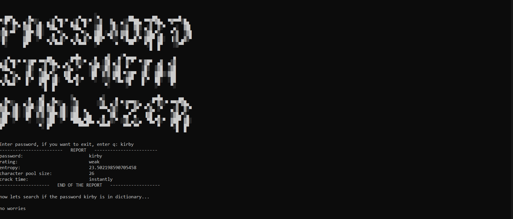

# Password Strength Analyzer

Bu proje, girilen parolaların güvenliğini entropi hesabı, sözlük tespiti, LeetSpeak dönüşümleri ve klavye desen analizi yöntemlerini birleştirerek analiz eden modüler bir Python CLI aracıdır.

## Ekran Görüntüleri

### Zayıf Şifre ve Desen Tespiti




## Çalıştırmak için:

```bash
python main.py
```